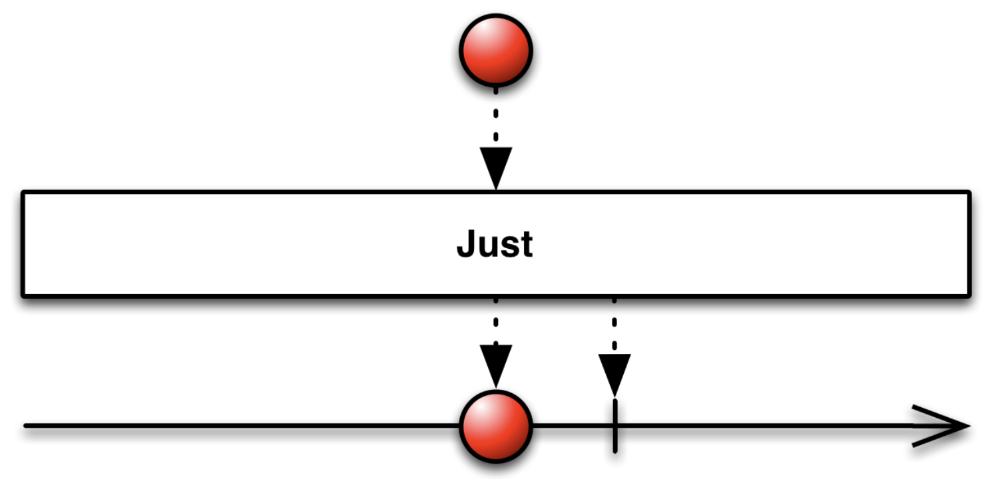
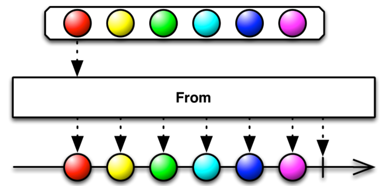
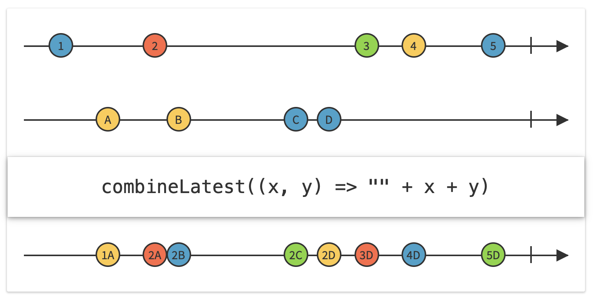
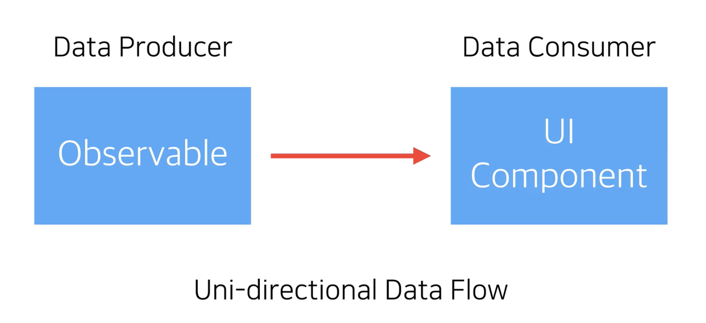
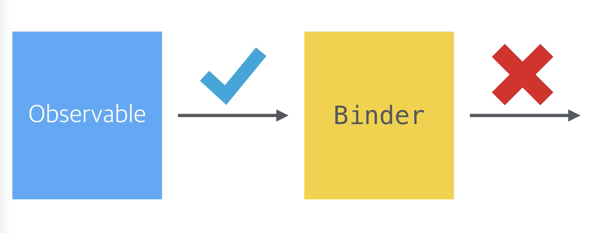

# [Mastering RxSwift] Observable 기초 및 연산자

> 참고 강의 :  [[Mastering RxSwift] Hello RxSwift - YouTube](https://www.youtube.com/watch?v=m41N4czHGF4&list=PLziSvys01Oek7ANk4rzOYobnUU_FTu5ns) 

### Observable 

- 이벤트를 감독하고 전달
- Subscript를 통해서 이벤트를 전달 ( Emission, 방출, 배출. ( onNext ) )
- [Notification] Error, Competed / Observable 의 Life Cycle의 마지막 단계에서 발생 

```swift
// 1번
Observable<Int>.create { (Observable) -> Disposable in 
	observable.on(.next(0))  // 0 전달
  obserbable.onNext(1)		 // 1 전달
                        
 	observable.onCompleted() // 완료, 이 이후 더이상 데이터를 전달 할 수 없음
                        
  return Disposables.create() // 메모리 정리를 위한 생성
}

// 2번
Observable.from([0,1]) 
// from 연산자는 배열안의 Int값을 순서대로 전달 해줌 ( 데이터가 방출되지는 않음, 정의만 한 상태)
// 해당 옵져버블을 구독하는 순간 onNext를 통해서 데이터를 전달함

```


### PublishSubject

- 서브젝트는 옵져버인 동시에 옵져버블
- 버플리쉬 서브젝트는 이벤트가 전달되면 즉시 구독자에게 전달
- 서브젝트가 최초로 생성되는 시점과 첫번째 구독이 시작되는 시점의 값(이벤트)은 그냥 사라지게 된다

```swift
let disposeBag = DisposeBag()

enum MyError: Error {
  case error
}

let subject = PublishSubject<String>() // 비어있는 서브젝트로 생성

subject.onNext("Hello") 

//새로운 옵져버 추가
let op1 = subject.subscribe { print(">> 1", $0) } // 구독 시작 
op1.disposed(by: disposeBag)

subject.onNext("RxSwift")

//새로운 옵져버 추가
let op2 = subject.subscribe { print(">> 2", $0) } // 구독
op2.disposed(by: disposeBag)

subject.onNext("Subject")

subject.onCompleted() // 서브젝트 완료

let op3 = subject.subscribe { print(">> 3", $0) } // 구독
op3.disposed(by: disposeBag)

/*
>> 1 next(Subject)
>> 2 next(Subject)
>> 1 completed
>> 2 completed
>> 3 completed  // next 이벤트는 전달되지 않음, completed 전달 후 즉시 종료
```


### just, of, from

#### just



- 하나의 항목을 방출하는 옵져버블 생성

- just 기본 타입

  - ```swift
      public static func just(_ element: Element) -> Observable<Element> {
        return Just(element: element)
      }
    ```

- 예제


```swift
let disposeBag = DisposeBag()
let elemnet = "😀"

Observable.just(element)
	.subscribe { evnet int print(event) }
	.disposed(by: disposeBag)

/* 출력 값
next(😀)
completed
*/

Observable.just([1,2,3])
	.subscribe { evnet int print(event) }
	.disposed(by: disposeBag)

/* 출력 값
next([1,2,3])  // 파라미터 배열을 형태 그대로 방출 ( from 과 비교 필요 )
completed
*/
```


### Of

- 여러개의 파라미터를 전달해야 하는 경우 사용 

- 방출할 요소를 원하는 만큼 사용 가능

- 기본 형태

  - ```swift
    Observable.of(<#T##elements: _...##_#>)
    
    public static func of(_ elements: Self.Element..., 
                          scheduler: RxSwift.ImmediateSchedulerType = CurrentThreadScheduler.instance
                         ) -> RxSwift.Observable<Self.Element>
    ```

- 예제

```swift
let disposeBag = DisposeBag()

let apple = "🍏"
let orange = "🍊"
let kiwi = "🥝"

Obserbable.of(apple, orange, kiwi)
	.subscribe { element in print(element) }
	.disposed(by:disposeBag)


/* 출력 값
next(🍏)
next(🍊)
next(🥝)
completed
*/

Observable.of([1,2],[3,4],[5,6])
	.subscribe { element in print(element) }
	.disposed(by:disposeBag)

/* 출력 값
next([1,2])
next([3,4])
next([5,6])
completed
*/
```


### from



- 배열의 요소를 하나하나 방출하는 연산자

- 기본 형태

  - ```swift
    public static func from(_ array: [Self.Element], 
                            scheduler: RxSwift.ImmediateSchedulerType = CurrentThreadScheduler.instance) -> RxSwift.Observable<Self.Element>
    ```

  - 배열형을 파라미터로 가지고, 리턴형은 배열의 요소

-  [ReactiveX - From operator](http://reactivex.io/documentation/ko/operators/from.html) 

- 예제 

```swift
let disposeBag = DisposeBag()
let fruits = ["🍏","🍎","🍋","🍓","🍇"]

Observable.from(fruits)
	.subscribe { element in print(element) }
	.disposed(by:disposeBag)

/* 출력 값
next(🍏)
next(🍎)
next(🍋)
next(🍓)
next(🍇)
completed
*/
```


### filter

- 사용자가 원하는 값만 선택해서 방출하는 연산자

- 기본형태

  - ```swift
    public func filter(_ predicate: @escaping (Self.Element) throws -> Bool) -> RxSwift.Maybe<Self.Element>
    ```

- 예제

```swift
let disposeBag = DisposeBag()
let numbers = [1, 2, 3, 4, 5, 6, 7, 8, 9, 10]

Observable.froe(numbers)
	.filter { $0.isMultiple(of: 2) } //짝수인 경우에 전달
	.subscribe { print($0) }
	.disposed(by: disposeBag)

/*
next(2)
next(4)
next(6)
next(8)
next(10)
completed
*/
```


### flatMap

- flatMap은 옵셔버들의 리턴 값들을 모아서 최종적으로 하나의 리턴값으로 만듬

- 네트워크 값을 사용할 때 주로 사용함

- 기본 형태

  - ```swift
     public func flatMap<Result>(_ selector: @escaping (Self.Element) throws -> RxSwift.Maybe<Result>) -> RxSwift.Maybe<Result>
    ```

- 예제

```swift
let disposeBag = DisposeBag()

let a = BehaviorSubject(value: 1)
let b = BehaviorSubject(value: 2)

let subject = PulishSubject<BehaviorSubject<Int>>()

subject
	// 서브젝트를 옵져버블로 변경해서 반환해야함
  // .flatMap(selector: (BehaviorSubject<Int>) throws -> ObservalbeSoncertibleType) 
  .flatMap { $0.asObservable() } // subject -> Observable 로 변경
	.subscribe { print($0) }
 	.disposed(by: disposeBag)

subject.onNext(a)
subject.onNext(b)
// next(1)
// next(2)

a.onNext(11)
b.onNext(22)
// next(11) 항목이 업데이트 될 떄마다 새로운 값을 방출하게 됨
// next(22)
```


### combineLatest



- 연산자가 리턴함 옵져버블이 언제 결과값을 리턴하는지 중요!

- 첫번째 숫자 이벤트가 발생했지만, 문자 이벤트가 발생하지 않았기 때문에 방출하는 값이 없음

- 하지만 `A`가 발생했을때 `1`과 `A` 가 함께 구독자에게 전달됨

- 그 후로는 마지막으로 발생한 값과 매칭하여 전달해줌 

  - 기본 형태

    - ```swift
       public static func combineLatest<O1, O2>(_ source1: O1, _ source2: O2, resultSelector: @escaping (O1.Element, O2.Element) throws -> Self.Element) -> RxSwift.Observable<Self.Element> where O1 : RxSwift.ObservableType, O2 : RxSwift.ObservableType
      // 옵져버블 반환 
      
      public static func combineLatest<O1, O2>(_ source1: O1, _ source2: O2) -> RxSwift.Observable<(O1.Element, O2.Element)> where O1 : RxSwift.ObservableType, O2 : RxSwift.ObservableType
      // 튜플 값으로 반환
      ```

- 예제

```swift
let bag = DisposeBag()

enum MyError: Error {
  case error
}

let greetings = PublishSubject<String>()
let languages = PublishSubject<String>()

Observable.combineLatest(greetings, languages) { lhs, rhs -> String in 
	// 클로져 전달
	return "\(lhs) \(rhs)"
}
	.subscribe { print($0) }
	.disposed(by: bag)

greetings.onNext("Hi") // 1. 해당 방법으로는 데이터가 전달되지 않음
languages.onNext("world!") // A. 두번째 comlineLatest가 발생했을때 실제로 completed되며 구독자에게 전달됨

greetings.onNext("Hello") // 2. 세번쩨 값, 기존 1번에서 생성된 값이랑 매핑해서 출력됨
language.onNext("RxSwift") // B. 값 추가

greetings.onCompleted()			// 컴플릿티드 이벤트 전달 or 중간에 onError 발생시 동일하게 종료 됨
languages.onNext("SwiftUI")	// C. 가장 마지막으로 방출한 값 (Hello) 와 같이 리턴

languages.onCompleted()			// languages에 컴플릿티드 이벤트 

/*
next(Hi world!)				// 1 + A
next(Hello world!)		// 2 + A
next(Hello RxSwift)		// 2 + B
next(Hello SwiftUI)		// 2 + C
completed							// 바인딩된 두 서브젝트가 둘다 completed되면 구독자에게 완료 알림
*/
```


### RxCocoa Binding

- 데이터를 UI로 전달하는 방법으로 사용됨



- 데이터 제공자와 소비자가 나눠져있고 데이터의 방향을 일방향이다. 
- 소비자는 어떠한 방식으로든 생산자에게 영향을 줄 수 없다.



- binder는 UI바인딩에 사용되는 특별한 옵저버
- 데이터 소비자의 역할을 수행
- 옵져버 이기 때문에 새로운 값을 전달가능, but 옵져버블이 아니기 때문에 구독자를 추가 하는것은 불가능
- 바인더는 에러 메시지르 받지않는다. (crach 발생)
- 바인더는 UI를 변경하기 때문에 main 쓰레드에서 동작하도록 보장해준다.


###           Reference

-  [[Mastering RxSwift] Observables and Observers #1 - YouTube](https://www.youtube.com/watch?v=POqRqaJE4ec&list=PLziSvys01Oek7ANk4rzOYobnUU_FTu5ns&index=2) 
-  [[Mastering RxSwift] PublishSubject - YouTube](https://www.youtube.com/watch?v=rlnbOzx-r-0&list=PLziSvys01Oek7ANk4rzOYobnUU_FTu5ns&index=3) 
-  [[Mastereing RxSwift] just, of, from - YouTube](https://www.youtube.com/watch?v=4-DLBA1LrQU&list=PLziSvys01Oek7ANk4rzOYobnUU_FTu5ns&index=4) 
-  [[Mastering RxSwift] flatMap Operator - YouTube](https://www.youtube.com/watch?v=1tnr0pRBUvo&list=PLziSvys01Oek7ANk4rzOYobnUU_FTu5ns&index=6) 
-  [[Mastering RxSwift] combineLatest Operator - YouTube](https://www.youtube.com/watch?v=mFKXd3Nlb3g&list=PLziSvys01Oek7ANk4rzOYobnUU_FTu5ns&index=7) 
-  [[Mastering RxSwift] Binding - YouTube](https://www.youtube.com/watch?v=V2qmm68IOhI&list=PLziSvys01Oek7ANk4rzOYobnUU_FTu5ns&index=8) 

