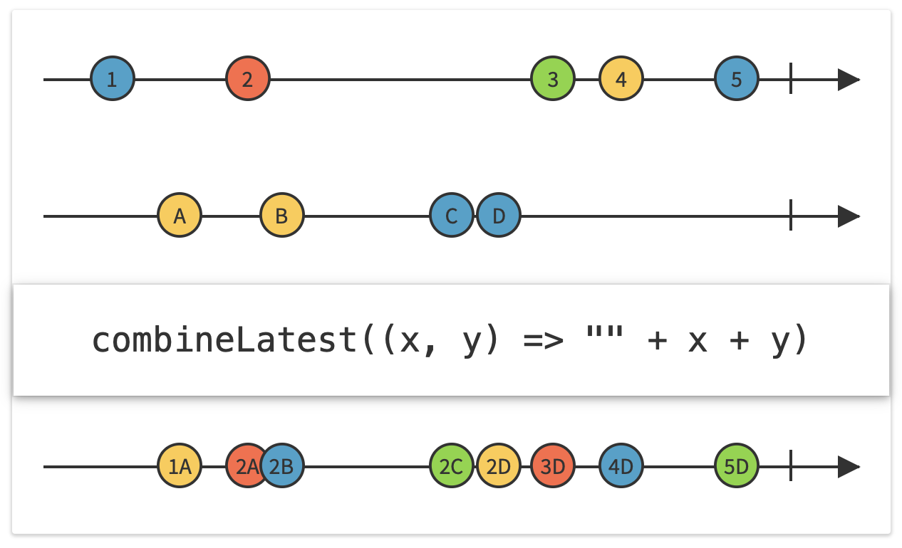
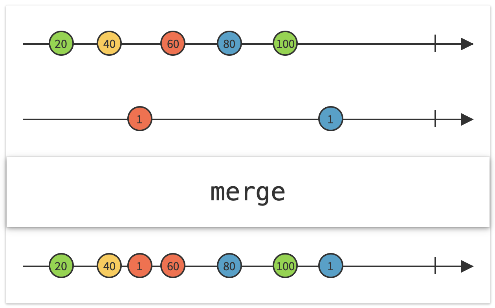
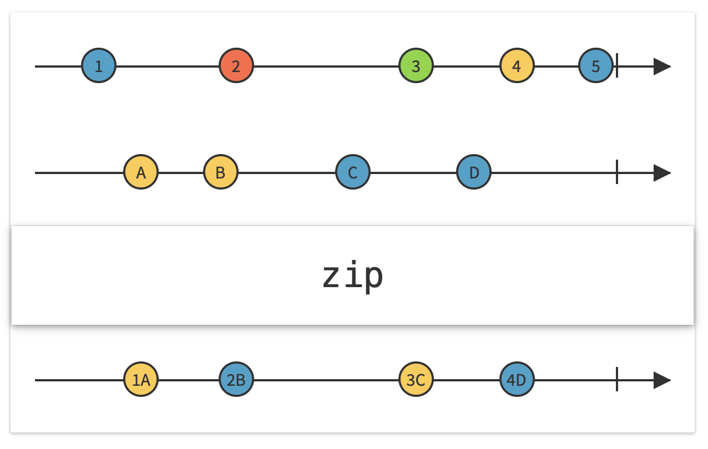
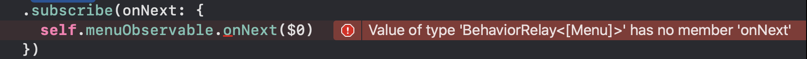
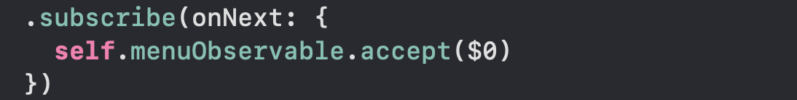

# RxSwift 4시간 만에 끝내기

> 참고 강의 :  [시즌2 모임 종합편 입니다. - YouTube](https://www.youtube.com/watch?v=iHKBNYMWd5I) by [곰튀김]( [곰튀김 - YouTube](https://www.youtube.com/channel/UCsrPur3UrxuwGmT1Jq6tkQw) )


### RxSwift 활용하기

#### 중요 사용 방법!

1. 비동기로 발생하는 데이터를 Observable로 감싸서 리턴
2. Observable로 오는 데이터를 받아서 처리하는 방법


#### Stream의 분리 및 병합

- share
  - 
- combine
  - 
- merge
  - 
- zip
  - 
- 


## RxCocoa

- UIKit의 Rx Extension을 적용
- 데이터바인딩

### driver

#### 이론

- RxCocoa를 통해서 UI 변경을 처리할때 <u>**기본적인 UI 변경과 관련된 사항</u>**들을 자동으로 처리해주는 연산자

- <u>기본적인 UI 대한 작업의 특징</u>

  1. Main 스레드에서만 동작해야 한다

     - ```swift
       .observeOn(MainScheduler.instance)
       ```

  2. 오류가 발생하더라도 화면을 표현하는데 문제가 없어야 한다.

     - ```swift
       .catchErrorJustReturn("")
       ```

  3. self로 인한 순환참조가 발생할 가능성이 있다.

#### 소스코드

- 기존 UI 변경 로직

```swift
viewModel.itemsCount
.map{ $0.currencyKR() }
.catchErrorJustReturn("")						// 오류가 발생한 경우 "" 리턴
.observeOn(MainScheduler.instance) 	// main 쓰레스에서 실행
.bind(to: itemCountLabel.rx.text)	  
.disposed(by: disposeBag)
```

- driver를 사용한 UI 변경 로직
  - 드라이버로 변경되면 에러처리가 가능하고, main 쓰레드에서 동작하도록 자동 설정됨

```swift
viewModel.itemsCount
.map{ $0.currencyKR() }
.asDriver(onErrorRecover: "")		// 에러 처리 가능
.drive(itemCountLabel.rx.text)	// 메인 쓰레드 동작 및 UI와 Properties Bind 
.disposed(by: disposeBag)
```


### BehaviorRelay

- UI와 연관이 있는 Subject의 경우 `BehaviorSubject` 대신 오류가 발생해도 무시하는 `BehaviorRelay`  사용


```swift
lazy var menuObservable = BehaviorSubject<[Menu]>(value: [])
```

```swift
lazy var menuObservable = BehaviorRelay<[Menu]>(value: [])
```


- `BehaviorSubject` 에서 `BehaviorRelay` 변경시 아래와 같은 에러 발생
  - 
- `BehaviorRelay`은 에러가 없이 무조건 값이 전달됨으로 에러 처리 없이 값을 무조건 받아서 처리해야함
  - 


### Refernce

-  [시즌2 모임 종합편 입니다. - YouTube](https://www.youtube.com/watch?v=iHKBNYMWd5I) 
-  [ReactiveX - Subject](http://reactivex.io/documentation/subject.html) 

